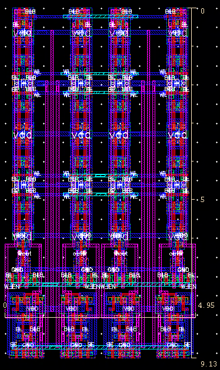
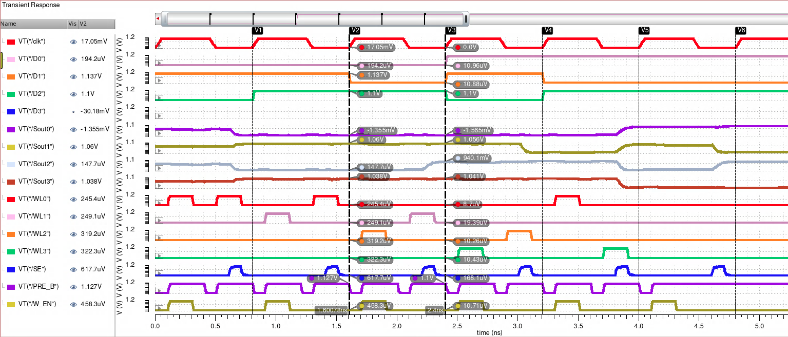

# CE391 CMOS Design

This folder contains the laboratories and project files for the CE391 CMOS Design course. It is configured to use the Cadence Virtuoso toolset with the FreePDK45 technology library.

## Directory Contents & Lab Reports

- **[Lab 1: CMOS Inverter Design & Layout](Lab1/CMOS_Lab1_gel8580.pdf)**
  Introduction to the Cadence Virtuoso toolset. Covers the schematic design, simulation, layout, DRC, and LVS verification of a basic CMOS inverter.
- **[Lab 2: NAND2 Gate Design](Lab2/CMOS_Lab2.pdf)**
  Focuses on the logical effort, theoretical transistor sizing, schematic simulation, and standard cell layout of a 2-input NAND gate, NOR gate, and MUX21.
- **[Lab 3: 4x4 SRAM Array Design (Focus Project)](Lab3/CMOS_Lab3.pdf)**
  Comprehensive design of a 4x4 SRAM array including the 6T SRAM bitcell, bitline precharge circuits, write drivers, and sense amplifiers. Includes post-layout simulations and full array layout.
- `Virtuoso_Tutorial.pdf`: Full step-by-step tutorial for the design flow.
- `env_vir.csh`: Environment variables and setup script.
- `cds.lib`: Cadence library definitions.

### Lab 3: SRAM Array Highlights

Below are some key figures from the Lab 3 SRAM implementation:

**4x4 SRAM Array Layout**



**Post-Layout Simulation Waveforms**




## Environment Setup

> [!IMPORTANT]
> You **MUST** source the environment setup script before starting any work in this directory.

Open a terminal and run the following command:

```bash
source env_vir.csh
```

This script performs the following initializations:
1. Sources the FreePDK45 basekit setup.
2. Sources the Cadence environment.
3. Sources the PyCell Studio configuration.

## Starting Cadence Virtuoso

Once the environment is sourced, you can start the Virtuoso tool by typing:

```bash
virtuoso
```

Wait until the program starts; three windows will appear. The main window is "Tools > Library Manager", which you will use for creating and managing your projects.

## Project Hierarchy

Cadence uses a three-level file hierarchy:
- **Library**: Your project file (e.g., `EECS391`). It holds all related cells.
- **Cell**: A directory for a specific component (e.g., `inverter`, `NAND`).
- **View**: Different types of designs for each cell (e.g., `schematic`, `symbol`, `layout`, `spectre`).

## Design Flow Overview

Refer to the [Virtuoso_Tutorial.pdf](Virtuoso_Tutorial.pdf) for detailed step-by-step instructions.

### 1. Schematic Design
- **Create Library**: File > New > Library (Attach to `NCSU_TechLib_FreePDK45`).
- **Create Cellview**: Select Library > File > New > Cellview (Type: `schematic`).
- **Build Schematic**: Use `NCSU_Devices` library (specifically `NMOS_VTG` and `PMOS_VTG`).
- **Check and Save**: Use the "Check and Save" tool to verify connections.

### 2. Simulation (ADE L)
- Launch Analog Design Environment (ADE L) from the schematic editor.
- **Setup**: Set simulator to `spectre` and model library to `hspice_nom.include`.
- **Analyses**: Configure transient (`tran`) analysis.
- **Outputs**: Select signals on the schematic to plot.
- **Run**: Click the green "Netlist and Run" button.

### 3. Layout Design
- **Create Layout**: File > New > Cellview (Type: `layout`, Application: `Layout L`).
- **Transistors**: Use `pmos_vtg` and `nmos_vtg` from `NCSU_TechLib_FreePDK45` (layout view).
- **Verification**: 
  - **DRC**: Run Calibre > Run DRC to check for design rule violations.
  - **LVS**: Run Calibre > Run LVS to ensure the layout matches the schematic.
  - **PEX**: Run Calibre > Run PEX for parasitic extraction.

## Essential Keyboard Shortcuts

### Schematic Editor
| Shortcut | Function |
| :--- | :--- |
| `i` | Add Instance |
| `w` | Create Wire |
| `p` | Create Pin |
| `q` | Properties |
| `l` | Label / Wire Name |
| `f` | Fit Zoom |
| `u` | Undo |

### Layout Editor
| Shortcut | Function |
| :--- | :--- |
| `i` | Create Instance |
| `r` | Draw Rectangle |
| `o` | Add Via / Contact |
| `k` | Ruler |
| `z` | Zoom In |
| `Shift + f` | Show Detailed PCells |
| `Ctrl + f` | Hide PCell Details |